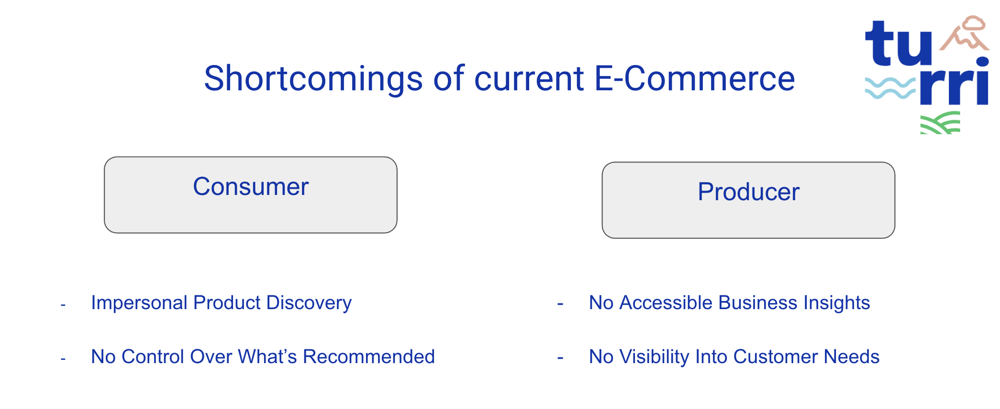
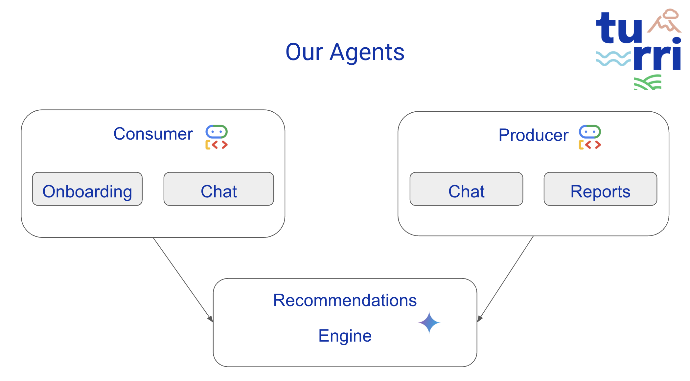
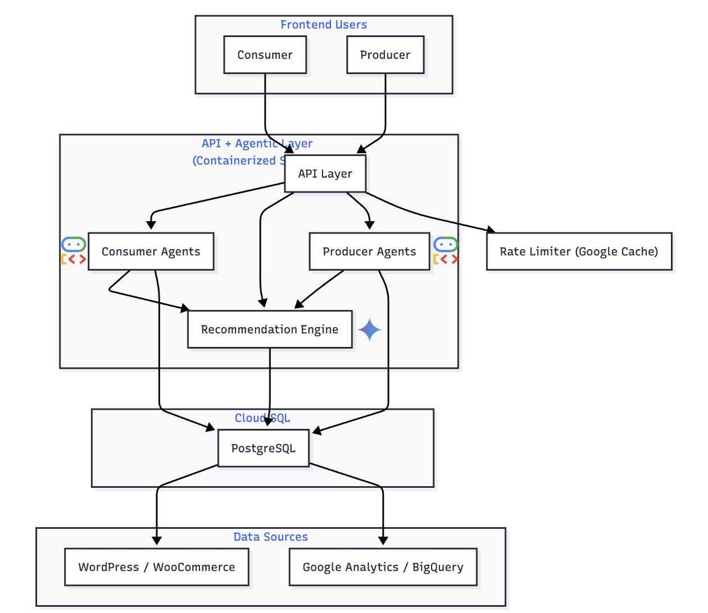

# Turri.CR – Connecting Communities through Agentic E-commerce

## 🌱 Who We Are

We’re based in Costa Rica’s Turrialba region — a place rich in culture, nature, and tradition. But beyond the beauty of the land, our true strength lies in its people: the _Creadores de Origen_ — passionate producers who preserve and reinvent the spirit of our heritage.

Turri.CR exists to connect these creators with the world. Our mission is to elevate their stories, products, and practices through technology, and empower them with meaningful insights while offering consumers a truly transparent, personalized experience.

## ❌ Shortcomings of Traditional E-Commerce



We began with a WordPress + WooCommerce storefront at [turri.cr](https://turri.cr), but quickly ran into friction:

### For Consumers

- **Impersonal Product Discovery**: Users scroll through menus with generic recommendations.
- **No Control Over What’s Recommended**: Users can’t influence or understand why products are shown.

### For Producers

- **No Accessible Business Insights**: It’s hard for producers to get meaningful, timely answers about sales or customer behavior.
- **No Visibility Into Customer Needs**: They lack understanding of who’s buying and why.

> These are not abstract problems. They're barriers to meaningful connection and growth — so we built something better.

---

## 🤖 What We Built — Agentic E-commerce Powered by ADK

With Google’s Agent Development Kit, we built a multi-agent system that transforms e-commerce into an intelligent, collaborative, and human-centered experience.



Our system consists of **4 agents** (2 consumer-facing, 2 producer-facing), orchestrated around a custom **Recommendation Engine**.

You can see them live in action in our Demo:
[](https://youtu.be/dZx3gqyguwc)

---

## 🧠 Consumer Experience

### Onboarding Agent

Starts a light conversation to build the user profile:

- Learns preferences
- Shows example producers/products
- Captures taste for use in recommendations

> Agent responses come with frontend components like quick-reply buttons, rich cards with product images, and links to our WooCommerce listings.

### Chat Agent

- Recommends producers/products using our profile-based engine.
- Uses RAG to answer:  
  _"Who is the producer?"_  
  _"How is this product made?"_
- Can access order history:  
  _"What cheese did I buy last month?"_
- **Profile Transparency**:  
  Users can ask why they’re seeing something, or update their preferences live:
  > “I liked that — show me more like it.”

### Upcoming Features

- Add/change/cancel orders
- Cart management via chat

### Guardrail

While not shown in the demo, our consumer agents include a guardrail that detects abusive language or manipulation attempts.

## 📈 Producer Experience

### Chat Agent

A data analyst in your pocket:

- Ask for trends, insights, or reports:  
  _"How did Product A perform over the last 3 months?"_
- Understand your customers:  
  _"What’s the typical user profile for my products?"_

### Report Generator

- Producers can plan reports via chat
- Agent triggers automatic report generation with gemini:
  - Clean plots
  - Summary insights
  - Delivered as PDF

As we did not have time in our demo to showcase it, here is a real sample conversation:

---

**You:**  
Write a report where you analyze where my users are from and what is the typical user profile of mine. More exactly, I would like to have a bar plot of customers by countries. I know that you don't have that information but can you aggregate it? Make sure to specify that the regions should be countries in the plot!

**Current Report Plan:**

```json
{
  "0": {
    "heading": "Customer Distribution by Country",
    "body": "This section will display a bar plot showing the number of users originating from different countries. The data will be aggregated from user region information.",
    "img_prompt": "Bar plot of customer counts by country of origin. Emphasize that regions are countries."
  },
  "1": {
    "heading": "Typical Customer Profiles",
    "body": "This section will provide a description of the typical customer profiles based on available customer data.",
    "img_prompt": ""
  }
}
```

**Bot Response:**  
Okay, I can help you with that. Here's a plan for your report:

**Sections to include:**

1. **User Demographics by Region (Countries):**
   - **Heading:** Customer Distribution by Country
   - **Body:** This section will display a bar plot showing the number of users originating from different countries. The data will be aggregated from user region information.
   - **Image Prompt:** "Bar plot of customer counts by country of origin. Emphasize that regions are countries."
2. **Customer Profile Analysis:**
   - **Heading:** Typical Customer Profiles
   - **Body:** This section will provide a description of the typical customer profiles based on available customer data.

I will add this to the report. Does that sound good?

---

**You:**  
Looks great, start to generate it!

**Current Report Plan:**

**Bot Response:**  
OK. I have added the two sections to the report and flagged the planning as complete. I'm now waiting for the signal to start generating the report.

---

And the resulting report can be viewed [here](report_agent_example.pdf)

---

## 🧬 The Recommendation Engine

We created a hybrid profile system powered by Gemini:

- **Descriptive Profiles**:  
  "User shows interest in Yogurt from Finca La Herencia, often browses Gourmet and Tradicional tags."

- **Taste Embeddings**:  
  Numeric vectors over axes like:  
  `"Gourmet", "Orgánico", "Saludable", "Queso Turrialba", etc.`

- **Similarity Scoring**:  
  score = taste*similarity * TASTE*FACTOR + description_similarity * DESC_FACTOR`

Profiles evolve continuously based on:

- Page views (Google Analytics → BigQuery)
- Purchase history (WooCommerce)
- Chat behavior (Onboarding + Chat Agent)

## 🛠️ Technical Implementation



### Data Layer

We began with our existing WordPress + WooCommerce setup, where products and producers are stored as custom post types. WooCommerce gives us order history and basic customer profiles, while Google Analytics captures browsing behavior. We pipe that analytics data into BigQuery, where we can query it efficiently.

We then constructed a PostgreSQL database (with `pgvector`) to unify all information:

- Structured data for products, producers, and customers
- Gemini-generated embeddings for both product descriptions and producer bios
- Precomputed metrics: product page views, customer regions, sales over time

Rather than treating BigQuery or WooCommerce as tools to call live, we ingest their results in advance and persist them in our DB. This gives us faster access and reduces response latency in the agents.

We also log what products/producers have been recommended to which users. These signals are used to refine profiles iteratively and to track the impact of recommendations.

Customer profiles — both structured and descriptive — are also stored here and updated over time.

---

### Agent + API Layer

All agent logic and API routing live in a single containerized FastAPI application built with SQLModel and Pydantic. The system includes:

- A Redis-based rate limiter for customer endpoints
- ADK agents: onboarding agent, chat agents for consumers and producers, and a report generation agent
- A REST API with routes for:
  - `/customer`: onboarding, chat, and recommendation requests
  - `/producer`: analytical chat and report requests
  - `/admin`: internal endpoints to trigger updates, syncs, and refinements

The agents are backed by Gemini models using function calling and structured output. The output is consumed by our frontend components — a system of cards, image previews, buttons, and links embedded in the chat UI. These components are rendered dynamically based on the agent response, which adheres to a JSON schema we designed specifically for this interface.

We are currently building a WordPress plugin to embed those frontend elements natively into our site and make the agent experience feel native.

---

### Deployment Strategy

The `Agent + API Layer` is containerized using Docker. While our prototype currently runs locally, everything is cloud-ready. In production, we plan to deploy via Google Cloud Run and use Cloud SQL, Memorystore, BigQuery, and Secret Manager. Our architecture diagram reflects these design decisions.

---

## 🔍 Findings & Learnings

The Agent Development Kit makes it easy to get a functional multi-agent chatbot system running quickly. The interface for defining tools and connecting them to natural language is smooth and fast for prototyping.

However, we found that **structured output and tool use cannot be combined in a single agent** — you must choose between one or the other. Since we rely on structured responses for rendering frontend components (cards, buttons, images), this limitation was restrictive.

We solved it by using a Gemini model separately for formatting output. But this creates friction in flows where we’d like an agent to call tools _and_ return structured UI output directly. Some of this may be skill-related, but we feel this area could be better supported by the framework.

We’d also like **more control over agent memory and orchestration**. It would be useful to:

- Explicitly control the message history (e.g., prune it, keep only facts, etc.)
- Define tighter loops or deterministic flows, like we do manually in our recommendation engine
- Inject structured external context into agents without relying on natural language alone

Right now, for tasks like report generation or profile updates, we often fallback to using Gemini directly with our own logic, rather than relying fully on ADK agents. It works, but it lives in a blurry space between chat and orchestration.

That said, ADK is a strong foundation — it helped us go from idea to multi-agent system rapidly. With more control over memory, tools _and_ structured outputs in one agent, and more orchestration primitives, it could become our primary runtime for all agentic tasks.
