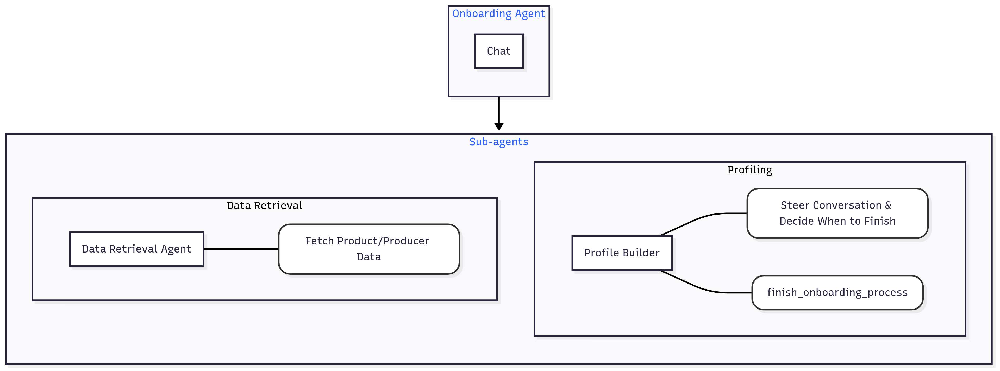
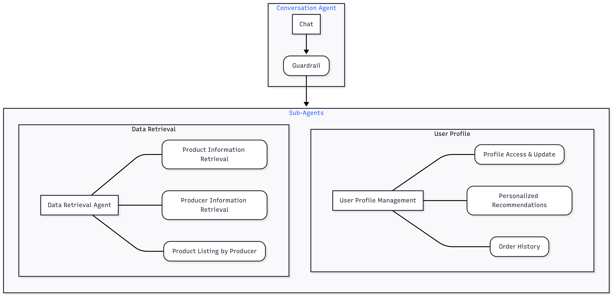
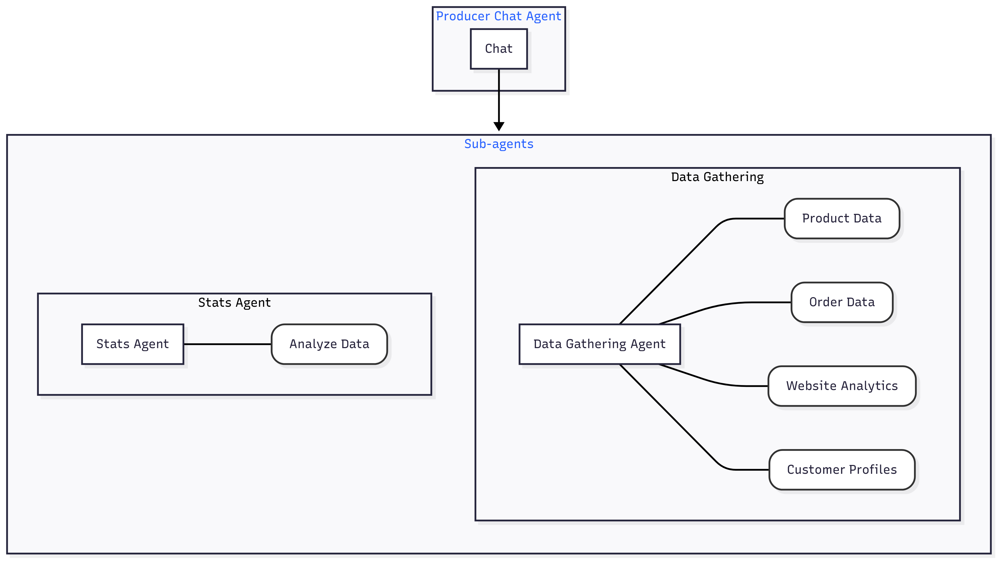
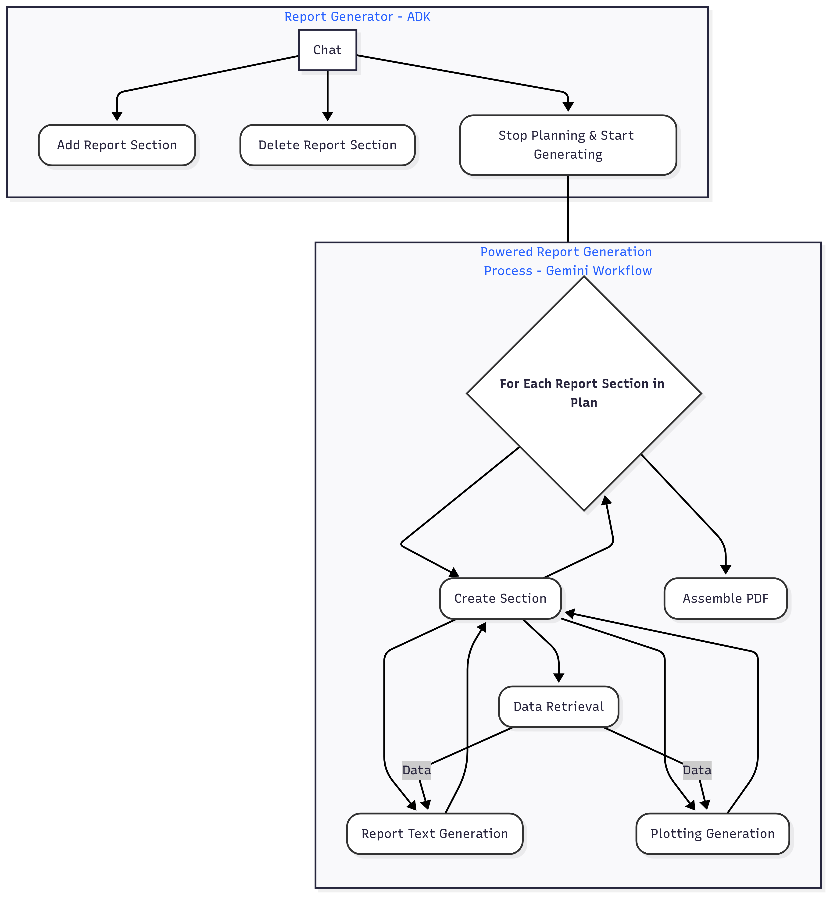

# Turri.CR – Connecting Communities through Agentic E-commerce

## 🌱 Who We Are

We’re based in Costa Rica’s Turrialba region — a place rich in culture, nature, and tradition. But beyond the beauty of the land, our true strength lies in its people: the _Creadores de Origen_ — passionate producers who preserve and reinvent the spirit of our heritage.

Turri.CR exists to connect these creators with the world. Our mission is to elevate their stories, products, and practices through technology, and empower them with meaningful insights while offering consumers a truly transparent, personalized experience.

## ❌ Shortcomings of Traditional E-Commerce


We began with a WordPress + WooCommerce storefront at [turri.cr](https://turri.cr), but quickly ran into friction:

### For Consumers

- **Impersonal Product Discovery**: Users scroll through menus with generic recommendations.
- **No Control Over What’s Recommended**: Users can’t influence or understand why products are shown.

### For Producers

- **No Accessible Business Insights**: It’s hard for producers to get meaningful, timely answers about sales or customer behavior.
- **No Visibility Into Customer Needs**: They lack understanding of who’s buying and why.

> These are not abstract problems. They're barriers to meaningful connection and growth — so we built something better.

---

## 🤖 What We Built — Agentic E-commerce Powered by ADK

With Google’s Agent Development Kit, we built a multi-agent system that transforms e-commerce into an intelligent, collaborative, and human-centered experience.


Our system consists of **4 agents** (2 consumer-facing, 2 producer-facing), orchestrated around a custom **Recommendation Engine**.

### You can see them live in action in our Demo:

[](https://youtu.be/dZx3gqyguwc)

---

## 🧠 Consumer Experience

### Onboarding Agent



Guides new users to build a profile through conversation.

- Captures preferences, dietary habits, and example products.
- Shows example producers/products

**Sub-agents:**

- **Profiling:**  
  Is in charge of creating the profile, asking the missing question
  and deciding when to stop, ie.e. we have sufficient information.
- **Data Retrieval:**  
  Fetches product/producer data

> Agent responses come with frontend components like quick-reply buttons, rich cards with product images, and links to our WooCommerce listings.

### Chat Agent



The main interaction point for consumers.

- Gives recommendations based on user profile.
- Answers questions like “Who made this?”, “What’s this product’s story?” "Do you have organic fruity coffe?"

- Can pull order history (“What cheese did I buy last month?”)
- Users can ask _why_ they see something or update their profile live.
  > “I liked that — show me more like it.”

**Sub-agents:**

- **User Profile:**  
  Fetches and updates user profile (with `get_user_profile`, `update_user_profile`), retrieves personalized recommendations (`get_personalized_product_recommendations_for_user`, `get_personalized_producer_recommendations_for_user`), and order history (`get_active_or_last_orders`).
- **Data Retrieval:**  
  Interfaces with WooCommerce data using:
  - `rag_fetch_products` (query-matched products)
  - `rag_fetch_producers` (matched producers)
  - `get_products_of_producer` (list all products for a producer)

**Guardrail:**  
Both agents include a guardrail system that detects and blocks abuse, manipulation, and off-topic noise.

## 📈 Producer Experience

### Chat Agent



Empowers producers to analyze their business by enabling direct, conversational access to their data and insights.

- Ask for trends, insights, or reports:
  _"How did Product A perform over the last 3 months?"_
- Understand your customers:
  _"What’s the typical user profile for my products?"_

**Sub-agents:**

- **Data Gathering:**
  Collects business data for the producer. It uses tools to fetch:

  - `get_products` (all products by the producer)
  - `get_orders_of_product` (sales data for a specific product)
  - `get_producer_webiste_views` (overall producer page views)
  - `get_product_website_views` (individual product page views)
  - `get_producer_website_users_counts_by_region` (user location data for producer pages)
  - `get_product_website_users_counts_by_region` (user location data for product pages)
  - `get_customer_profiles` (profiles of customers who bought from the producer)

- **Stats Agent:**
  Performs data analysis via code exectuion.

### Report Generator



Facilitates comprehensive business reporting, allowing producers to plan and generate custom reports via chat.

- Producers can plan reports via chat, adding and deleting sections (`add_report_section`, `delete_report_section`).
- Agent triggers automatic report generation with Gemini, resulting in a Report PDF with multiple sections, each with texts and plots.

As we did not have time in our demo to showcase it, here is a real sample conversation:

---

**You:**  
Write a report where you analyze where my users are from and what is the typical user profile of mine. More exactly, I would like to have a bar plot of customers by countries. I know that you don't have that information but can you aggregate it? Make sure to specify that the regions should be countries in the plot!

**Current Report Plan:**

```json
{
  "0": {
    "heading": "Customer Distribution by Country",
    "body": "This section will display a bar plot showing the number of users originating from different countries. The data will be aggregated from user region information.",
    "img_prompt": "Bar plot of customer counts by country of origin. Emphasize that regions are countries."
  },
  "1": {
    "heading": "Typical Customer Profiles",
    "body": "This section will provide a description of the typical customer profiles based on available customer data.",
    "img_prompt": ""
  }
}
```

**Bot Response:**  
Okay, I can help you with that. Here's a plan for your report:

**Sections to include:**

1. **User Demographics by Region (Countries):**
   - **Heading:** Customer Distribution by Country
   - **Body:** This section will display a bar plot showing the number of users originating from different countries. The data will be aggregated from user region information.
   - **Image Prompt:** "Bar plot of customer counts by country of origin. Emphasize that regions are countries."
2. **Customer Profile Analysis:**
   - **Heading:** Typical Customer Profiles
   - **Body:** This section will provide a description of the typical customer profiles based on available customer data.

I will add this to the report. Does that sound good?

---

**You:**  
Looks great, start to generate it!

**Current Report Plan:**

**Bot Response:**  
OK. I have added the two sections to the report and flagged the planning as complete. I'm now waiting for the signal to start generating the report.

---

And the resulting report can be viewed [here](report_agent_example.pdf)

---

## 🧬 The Recommendation Engine

We created a hybrid profile system powered by Gemini:

- **Descriptive Profiles**:  
  "User shows interest in Yogurt from Finca La Herencia, often browses Gourmet and Tradicional tags."

- **Taste Embeddings**:  
  Numeric vectors over axes like:  
  `"Gourmet", "Orgánico", "Saludable", "Queso Turrialba", etc.`

- **Similarity Scoring**:  
  score = taste*similarity * TASTE*FACTOR + description_similarity * DESC_FACTOR`

Profiles evolve continuously based on:

- Page views (Google Analytics → BigQuery)
- Purchase history (WooCommerce)
- Chat behavior (Onboarding + Chat Agent)

## 🛠️ Technical Implementation


### Data Layer

We began with our existing WordPress + WooCommerce setup, where products and producers are stored as custom post types. WooCommerce gives us order history and basic customer profiles, while Google Analytics captures browsing behavior. We pipe that analytics data into BigQuery, where we can query it efficiently.

We then constructed a PostgreSQL database (with `pgvector`) to unify all information:

- Structured data for products, producers, and customers
- Gemini-generated embeddings for both product descriptions and producer bios
- Precomputed metrics: product page views, customer regions, sales over time

Rather than treating BigQuery or WooCommerce as tools to call live, we ingest their results in advance and persist them in our DB. This gives us faster access and reduces response latency in the agents.

We also log what products/producers have been recommended to which users. These signals are used to refine profiles iteratively and to track the impact of recommendations.

Customer profiles — both structured and descriptive — are also stored here and updated over time.

---

### Agent + API Layer

All agent logic and API routing live in a single containerized FastAPI application built with SQLModel and Pydantic. The system includes:

- A Redis-based rate limiter for customer endpoints
- ADK agents: onboarding agent, chat agents for consumers and producers, and a report generation agent
- A REST API with routes for:
  - `/customer`: onboarding, chat, and recommendation requests
  - `/producer`: analytical chat and report requests
  - `/admin`: internal endpoints to trigger updates, syncs, and refinements

The agents are backed by Gemini models using function calling and structured output. The output is consumed by our frontend components — a system of cards, image previews, buttons, and links embedded in the chat UI. These components are rendered dynamically based on the agent response, which adheres to a JSON schema we designed specifically for this interface.

We are currently building a WordPress plugin to embed those frontend elements natively into our site and make the agent experience feel native.

---

### Deployment Strategy

The `Agent + API Layer` is containerized using Docker. While our prototype currently runs locally, everything is cloud-ready. In production, we plan to deploy via Google Cloud Run and use Cloud SQL, Memorystore, BigQuery, and Secret Manager. Our architecture diagram reflects these design decisions.

---

## 🔍 Findings & Learnings

Having previously developed chatbots with explicitly defined states and conversational graphs, I was genuinely impressed by the capabilities of the Agent Development Kit (ADK). Given the right set of tools, the ADK truly enables the creation of a great chatbot experience in just minutes and a few lines of code, all without the need to manually define a complex chatbot graph – which is exceptionally impressive.

However, a few areas emerged where I felt improvements could be made. Primarily, the inability for an agent to simultaneously leverage sub-agents or tools and generate structured output felt suboptimal. This led us to incorporate a separate Gemini call at the end of our workflow specifically to reliably generate our desired output components.

A minor point of friction was that ADK agents currently cannot have multiple parent-agents directly; however, this can be easily mitigated by wrapping them in factory functions.

In more complex workflow scenarios, such as generating a report for our producers via the Report Agent, I found it challenging to make the ADK work as seamlessly as desired. Given our limited time, I ultimately reverted to a more direct Gemini-based workflow for that specific functionality.

It would be highly beneficial if ADK could support agents in a more deterministic and controlled, less chat-centric manner. This would allow for capabilities like:

- Easily looping over data.
- More granular control over and dynamic updates to system prompts and message history, for instance, tailoring them precisely for each report section.
- Explicitly controlling the message history (e.g., pruning it, retaining only factual information).

- Defining tighter loops or deterministic flows, similar to the manual orchestration we currently employ in our recommendation engine.

It's challenging to fully articulate, but there appears to be a spectrum between pure agentic behavior and deterministic control. While the ADK excels in the former, I encountered difficulties when needing more precise control. Enhancements in these areas would allow ADK to become our primary runtime for an even broader range of agentic tasks.

## Vision

Our agentic e-commerce platform represents a foundational step towards a more connected marketplace. Looking ahead, our vision for Turri.CR includes expanding the system's capabilities through additional specialized agents and leveraging advanced AI tools:

- **Introducing Admin Agents:** We envision a suite of dedicated Admin Agents to automate critical backend processes. These agents will be responsible for:

  - **Data Freshness & Maintenance:** Continuously updating and ensuring the integrity of our database.
  - **Comprehensive Business Reporting:** Generating in-depth reports beyond the current conversational capabilities, offering richer analytical insights.
    For these administrative tasks, we are keen to explore less rigidly defined tool spaces, such as those offered by `AI Toolbox for Databases`. While we opted for clear, controlled, and streamlined tool use in our consumer and producer-facing agents for immediate stability, an `AI Toolbox` could offer powerful, flexible querying for internal operations.

- **Evolving the Recommendation Engine into an ADK Agent:** A key future enhancement involves transforming our existing hybrid recommendation system into a dedicated ADK agent. Each user could then have their own persistent "conversation" with this agent. New browsing activity, shopping data, or insights from chatbot interactions would trigger new messages to this recommendation agent, allowing it to continuously refine and push highly personalized product and producer suggestions in real-time.

## 📂 Our Code

<a href="https://github.com/turrico/turri-agentic-ecommerce" target="_blank">
  
</a>

Explore the code on GitHub:
[github.com/turrico/turri-agentic-ecommerce](https://github.com/turrico/turri-agentic-ecommerce)

## 🎬 Demo Video

[](https://youtu.be/dZx3gqyguwc)

See our system in action:
[youtu.be/dZx3gqyguwc](https://youtu.be/dZx3gqyguwc)

## 📝 Blog Post

Read more about our journey:
[Bridging the Gap: How Agentic AI Can Empower Costa Rica's Rural Producers and Conscious Consumers](https://turri.cr/bridging-the-gap-how-agentic-ai-can-empower-costa-ricas-rural-producers-and-conscious-consumers/)
